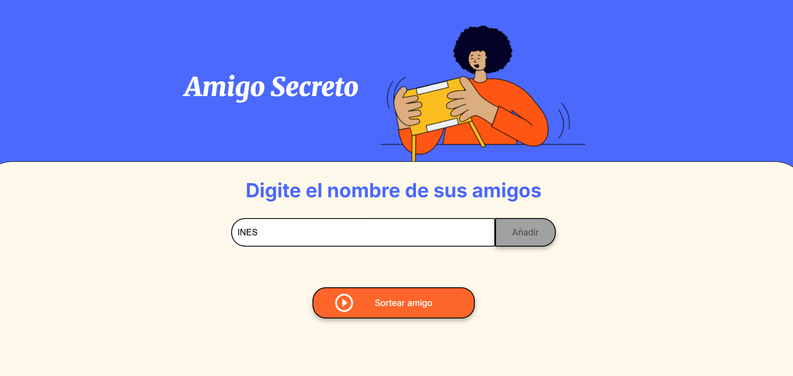
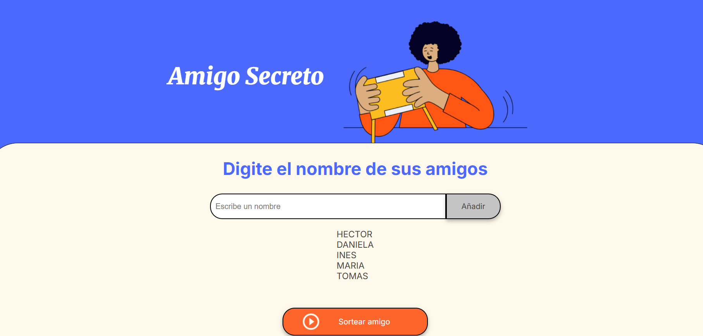
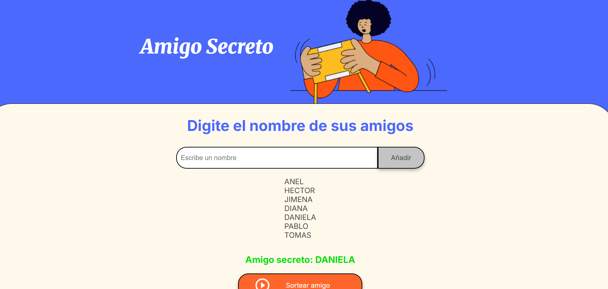

# AMIGO SECRETO

Hola, bienvenido al Desafio del Amigo Secreto del programa Oracle Next Education

Funcionalidades:
-  **Agregar nombres** desde un campo de texto.  
-  **Validación**: si está vacío, muestra `alert("Por favor, inserte un nombre.")`.  
-  **Visualizar lista**: cada nombre ingresado se puede ver  
-  **Sorteo aleatorio** con `Math.random()` + `Math.floor()` y resultado visible en pantalla 
-  **Atajo de teclado**: tecla **Enter** para añadir   
- 

## ¿Cómo jugar?

DEMO https://gisellemdc.github.io/Amigo-Secreto/

1. **Escribe tu nombre** y presiona **Añadir**.  
   

2. **Verifica que todos los nombres aparezcan en la lista** 
   

3. Presiona **Sortear amigo** para ver el nombre seleccionado.  
   

4. Para **reiniciar**, puedes refrescar la página (F5)

Hecho por Giselle Morales.

   
